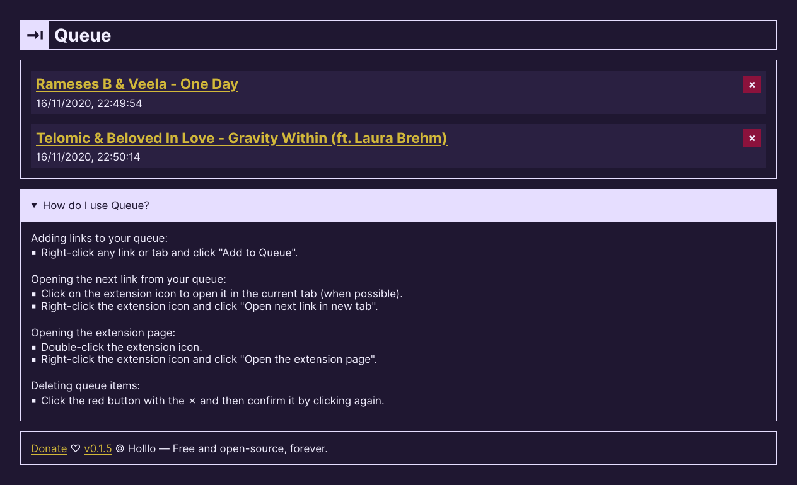

# Queue

> A WebExtension for queueing links.

[](https://addons.mozilla.org/firefox/addon/holllo-queue)



## Installation

* Queue is available [through AMO](https://addons.mozilla.org/firefox/addon/holllo-queue/).
* Or via manual installation by either building from source yourself or using a prebuilt version available in the [Releases page](https://github.com/Holllo/queue/releases).

## Development

[Node.js LTS](https://nodejs.org) and [Yarn](https://yarnpkg.com/) are required to build and develop the extension. As well as a relatively recent version of [Firefox](https://www.mozilla.org/firefox/).

To get started, [a script](https://github.com/Holllo/queue/blob/main/docs/scripts/clone-and-install.sh) to clone the repository and install the dependencies is available. You can download and execute the script in one go with the following command.

```sh
bash -c "$(curl -fsSL https://raw.githubusercontent.com/Holllo/queue/main/docs/scripts/clone-and-install.sh)"
```

To test the extension, run `yarn start:firefox`.

To develop and reload the extension on changes, run `yarn watch` in one terminal and `yarn start:firefox` in another.

## Changelog

All changes made can be found for every version in [Releases page](https://github.com/Holllo/queue/releases).

## License

Licensed under [AGPL-3.0-or-later](https://github.com/Holllo/queue/blob/main/LICENSE).
